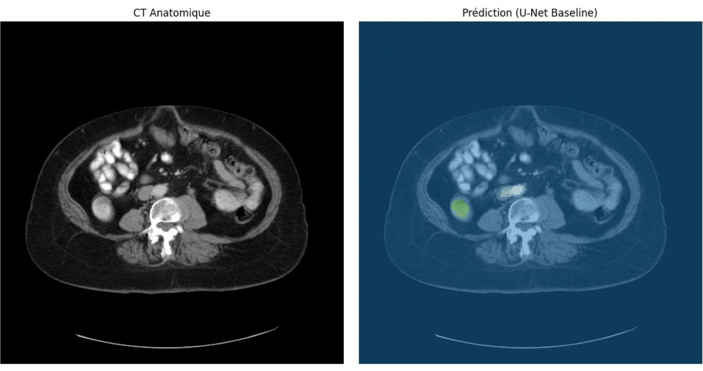
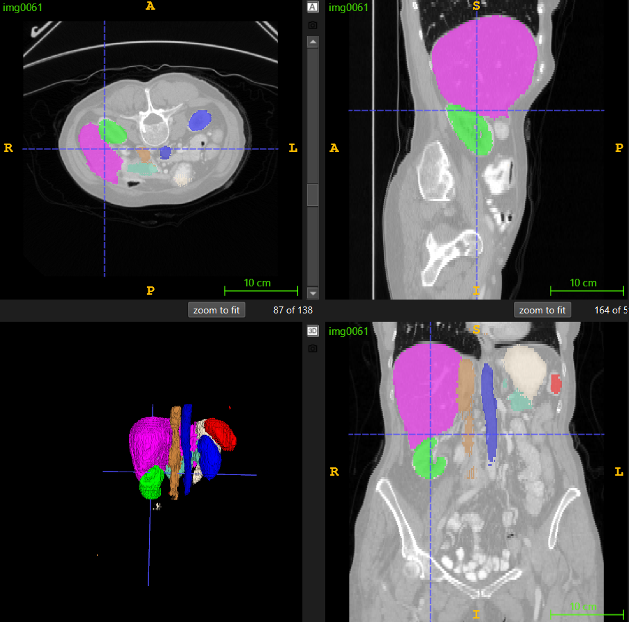

# 🫀 3D Organ Mapper : Segmentation Multi-Organes par Deep Learning


## 📌 Contexte Clinique
La segmentation automatique des organes sur des scanners 3D (CT scans) est un enjeu majeur en imagerie médicale. Elle permet de :
* **Planifier la radiothérapie** en protégeant les organes sains (Organ-At-Risk).
* **Préparer les interventions chirurgicales** en offrant une cartographie 3D précise au chirurgien.
* **Accélérer le flux de travail** des radiologues en automatisant le détourage manuel.

Ce projet vise à développer un pipeline MLOps complet capable de segmenter simultanément **14 organes de l'abdomen** à partir de volumes CT bruts, en comparant une approche classique (U-Net) avec l'état de l'art des Vision Transformers (Swin UNETR).

---

## ⚙️ Pipeline de Données (MONAI)
Contrairement aux images 2D classiques (RGB), l'imagerie médicale 3D nécessite un pré-traitement rigoureux respectant la physique de l'acquisition. Ce projet utilise la librairie **MONAI** pour garantir l'intégrité clinique des données :

* **`Orientationd (axcodes="RAS")`** : Standardisation de l'orientation anatomique (Right, Anterior, Superior) pour tous les patients.
* **`Spacingd (1.5, 1.5, 2.0 mm)`** : Rééchantillonnage isométrique pour que le modèle apprenne la "vraie" taille physique des organes.
* **`ScaleIntensityRanged`** : Application d'un *Windowing* basé sur les Unités Hounsfield (HU) de l'abdomen, borné entre -175 (air) et 250 (os).
* **`RandCropByPosNegLabeld`** : Extraction dynamique de patchs 3D équilibrés pour gérer le déséquilibre de classes (organes massifs vs petits organes) et optimiser la VRAM.

---

## 🛠️ Défis d'Ingénierie & MLOps (Contrainte : 4 Go VRAM)
L'entraînement de modèles 3D massifs est notoirement coûteux en mémoire. Pour faire tourner un Transformer State-of-the-Art de 62 millions de paramètres sur une configuration locale limitée à 4 Go de VRAM et une RAM système restreinte, plusieurs stratégies ont été implémentées :

1. **CPU Offloading & Métriques ciblées :** Déplacement des tenseurs de validation sur la RAM hôte et suppression du calcul de la *Validation Loss* géante au profit du *Dice Score* calculé via des tenseurs `one_hot` optimisés.
2. **Gradient Accumulation :** Réduction du `batch_size` effectif à 1 avec accumulation des gradients sur 8 itérations pour simuler un grand batch size sans exploser la VRAM.
3. **Patch-based Validation :** Abandon du *Sliding Window Inference* global en phase de validation au profit d'une évaluation par patchs pour prévenir les erreurs d'allocation système (`alloc_cpu.cpp OOM`).

Toutes les expériences sont trackées dynamiquement sur **Weights & Biases**.

---

## 📊 Expériences & Résultats : U-Net vs Swin UNETR

Deux architectures ont été entraînées sur un sous-échantillon de données très restreint (24 images d'entraînement) pour observer leur comportement en régime "Low-Data".

| Modèle | Paramètres | Architecture | Dice Score (Val) |
| :--- | :--- | :--- | :--- |
| **U-Net (Baseline)** | 4.8 M | Convolutions (CNN) | **~ 44 %** |
| **Swin UNETR (SOTA)** | 62.2 M | Vision Transformer | ~ 8 % (Plafond à 20%) |

### 💡 Analyse des résultats
L'expérience prouve une règle fondamentale du Deep Learning : **le biais inductif face au besoin de données**.
Le **U-Net**, grâce à la nature de ses convolutions, comprend nativement la contiguïté spatiale (les pixels voisins forment des bords). Il parvient à extraire des caractéristiques pertinentes même avec 24 images.
À l'inverse, le **Swin UNETR**, dépourvu de ce biais inductif, utilise des mécanismes d'Attention qui nécessitent des milliers d'exemples pour "comprendre" l'image. En l'absence de *Pre-training* massif, ses 62 millions de paramètres ont sévèrement sur-appris (*overfitting*) sur le set d'entraînement.

---

## 👁️ Visualisation des Inférences
Le script d'inférence intègre la transformation `Invertd` de MONAI pour replacer les prédictions 3D exactement dans l'espace physique original du patient (512x512).

### Surcouche Anatomique (Coupe Axiale)
> *À gauche : Le scanner CT brut. À droite : La prédiction 3D du U-Net Baseline superposée.*



### Rendu 3D (ITK-SNAP)
> *Modélisation 3D des organes segmentés par l'IA sur un set de test aveugle.*



---

## 🚀 Utilisation & Reproductibilité

**1. Installation des dépendances :**

```bash
pip install -r requirements.txt
```

**2. Lancement de l'entraînement :**
Modifiez l'architecture souhaitée (unet ou swin_unetr) dans scripts/train.py.

```bash
python scripts/train.py
```

**3. Lancement de l'inférence :**
Génère les volumes .nii.gz prédits à partir de vos meilleurs checkpoints.

```bash
python scripts/predict.py
```